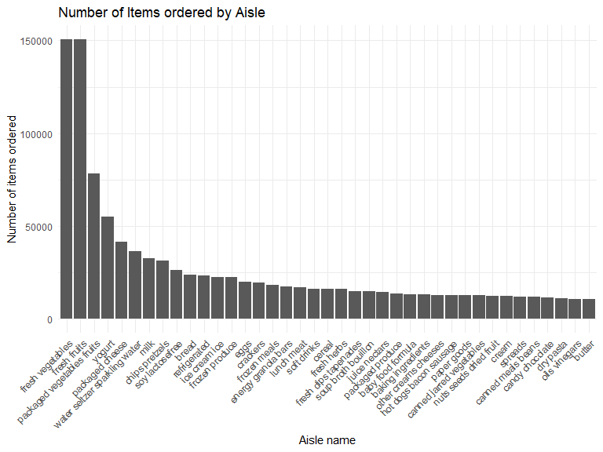
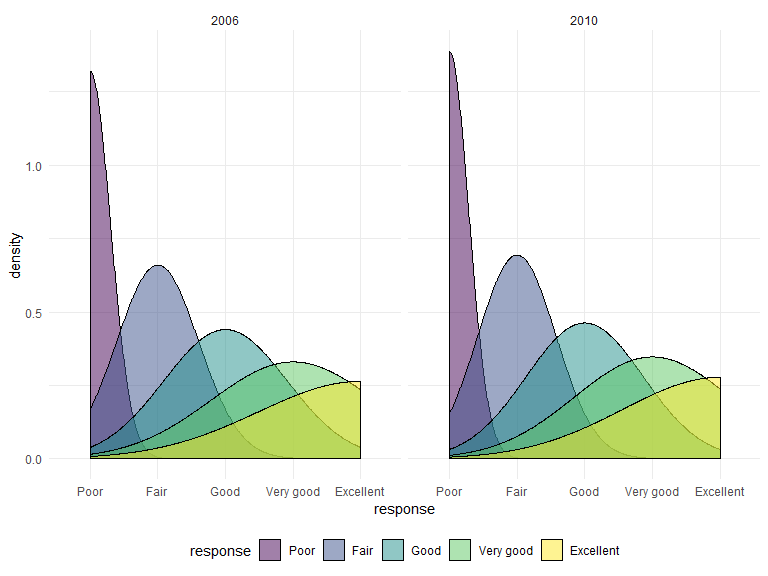
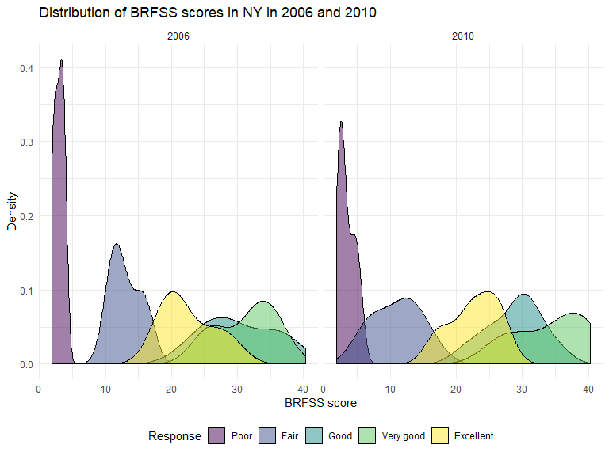
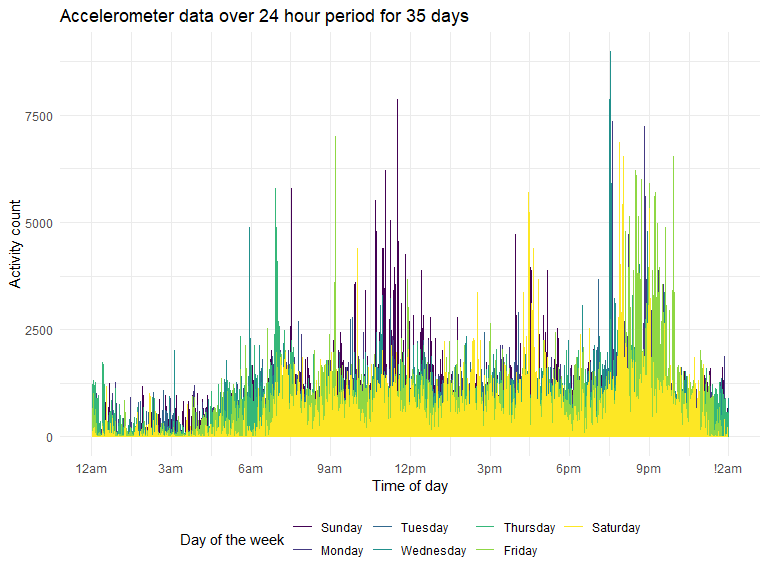

HW 3
================
Ford Holland
10/5/2019

## Problem 1

The Instacart dataset contains 1384617 observations of 15 variables,
describing the orders of 131209 Instacart customers. Only one order per
customer is captured, and each row represents a product from a
particular order.

Some variables of interest include the time logging values
`order_hour_of_day` and `order_dow`, the time and day of the week that
an order was placed. Together with the `product_name` field, these
values allow Instacart to determine their busiest times and most
demanded products, and predict when certain items may need to be
stocked. The mean hour of the day for all orders is 13.5775922, or about
1:30 pm. Order hours range from 0 to 23, or midnight to 11 pm.

The `days_since_prior_order` field, recording the days since the last
order for a customer, might allow Instacart to reward their recurring
customers through loyalty programs and offer incentives to bolster
orders from infrequent customers. The mean and median days since prior
order are 17 and 15, respectively.

There are 134 aisles captured, and the most items are ordered from
aisles storing fruits, vegetables, and refrigerated goods, especially
dairy products.

``` r
# load instacart data
data("instacart")

# number of aisles 
instacart %>% 
  count(aisle_id) %>% 
  nrow()
```

    ## [1] 134

``` r
# aisles with the most items ordered
instacart %>% 
  count(aisle_id, aisle) %>% 
  arrange(desc(n))
```

    ## # A tibble: 134 x 3
    ##    aisle_id aisle                              n
    ##       <int> <chr>                          <int>
    ##  1       83 fresh vegetables              150609
    ##  2       24 fresh fruits                  150473
    ##  3      123 packaged vegetables fruits     78493
    ##  4      120 yogurt                         55240
    ##  5       21 packaged cheese                41699
    ##  6      115 water seltzer sparkling water  36617
    ##  7       84 milk                           32644
    ##  8      107 chips pretzels                 31269
    ##  9       91 soy lactosefree                26240
    ## 10      112 bread                          23635
    ## # ... with 124 more rows

The plot below shows the number of products ordered for each aisle with
more than 10000 items ordered. The figure demonstrates the significant
difference in volume between the top few aisles and the rest.

``` r
# process data for plot
ggp_orders = instacart %>% 
  group_by(aisle_id) %>% 
  mutate(n_items = n()) %>% 
  filter(n_items > 10000) %>% 
  select(aisle_id, aisle, n_items) %>% 
  distinct() %>% 
  arrange(desc(n_items)) %>% 
  ungroup()

# create bar chart for aisle volume
ggp_orders %>%   
  ggplot(aes(x = reorder(aisle, -n_items), y = n_items)) +
  geom_bar(stat = "identity") +
  labs(title = "Number of Items ordered by Aisle", x = "Aisle name", y = "Number of items ordered") +
  theme(axis.text.x = element_text(angle = 45, hjust = 1))
```



The table below shows the three most popular items for the “baking
ingredients”, “dog food care”, and “packaged vegetables fruits” aisles.
It reveals that within the high-volume aisle of “packaged vegetables
fruits,” there is a significant disparity even between the top three
products, suggesting that the total product volume may be driven by
relatively few items.

``` r
# process data for table
df_aisle_table = instacart %>% 
  group_by(aisle) %>% 
  filter(aisle %in% 
           c("baking ingredients",
             "dog food care",
             "packaged vegetables fruits")) %>% 
  select(aisle, product_name) %>% 
  count(aisle, product_name) %>% 
  top_n(3) %>% 
  arrange(desc(n)) %>% 
  ungroup()
```

    ## Selecting by n

``` r
# create table of 3 most popular products by aisle
df_aisle_table %>% 
  knitr::kable(
    col.names = c("Aisle name", "Product name", "Number ordered"),
    caption = "Three most ordered items for \"baking ingredients\", \"dog food care\", and \"packaged vegetables and fruits\" aisles"
  )
```

| Aisle name                 | Product name                                  | Number ordered |
| :------------------------- | :-------------------------------------------- | -------------: |
| packaged vegetables fruits | Organic Baby Spinach                          |           9784 |
| packaged vegetables fruits | Organic Raspberries                           |           5546 |
| packaged vegetables fruits | Organic Blueberries                           |           4966 |
| baking ingredients         | Light Brown Sugar                             |            499 |
| baking ingredients         | Pure Baking Soda                              |            387 |
| baking ingredients         | Cane Sugar                                    |            336 |
| dog food care              | Snack Sticks Chicken & Rice Recipe Dog Treats |             30 |
| dog food care              | Organix Chicken & Brown Rice Recipe           |             28 |
| dog food care              | Small Dog Biscuits                            |             26 |

Three most ordered items for “baking ingredients”, “dog food care”, and
“packaged vegetables and fruits” aisles

This table shows the mean hour of the day that Pink Lady Apples and
Coffee Ice Cream are ordered for each day of the week. It is interesting
that Coffee Ice Cream tends to be ordered later in the day than Pink
Lady Apples, particularly on weekdays (besides Friday, when Coffee Ice
Cream is ordered earliest).

``` r
# process data and create table
instacart %>% 
  filter(product_name == "Pink Lady Apples" | 
           product_name == "Coffee Ice Cream") %>% 
  group_by(order_dow, product_name) %>% 
  summarize(mean = mean(order_hour_of_day)) %>% 
  ungroup() %>% 
  pivot_wider(names_from = order_dow, values_from = mean) %>% 
  knitr::kable(
    col.names = c("Product name",
                  "Sunday",
                  "Monday",
                  "Tuesday",
                  "Wednesday",
                  "Thursday",
                  "Friday",
                  "Saturday"),
    caption = "Mean hour of the day of product purchase",
    digits = 2)
```

| Product name     | Sunday | Monday | Tuesday | Wednesday | Thursday | Friday | Saturday |
| :--------------- | -----: | -----: | ------: | --------: | -------: | -----: | -------: |
| Coffee Ice Cream |  13.77 |  14.32 |   15.38 |     15.32 |    15.22 |  12.26 |    13.83 |
| Pink Lady Apples |  13.44 |  11.36 |   11.70 |     14.25 |    11.55 |  12.78 |    11.94 |

Mean hour of the day of product purchase

## Problem 2

The chunk below loads and processes the BRFSS data. I clean the names
using the `janitor` package and filter to only “Overall Health”
observations and parse the response field as a factor.

``` r
data("brfss_smart2010")

brfss_smart2010 = brfss_smart2010 %>% 
  janitor::clean_names() %>% 
  rename(
    location_abbr = locationabbr,
    location_desc = locationdesc,
    resp_id = respid
  ) %>% 
  filter(topic == "Overall Health") %>% 
  # no other response values to exclude for overall health
  mutate(response = response %>% 
           factor(levels = c("Poor", "Fair", "Good", "Very good", "Excellent"))) 
```

In 2002, Connecticut, Florida, Massachusetts, North Carolina, New
Jersey, and Pennsylvania were observed at 7 or more locations.
Pennsylvania was observed in 10 counties, the most of any state in the
dataset.

``` r
brfss_smart2010 %>% 
  filter(year == 2002) %>% 
  count(location_abbr, location_desc) %>% 
  group_by(location_abbr) %>% 
  filter(n() >= 7) %>% 
  distinct(location_abbr)
```

    ## # A tibble: 6 x 1
    ## # Groups:   location_abbr [6]
    ##   location_abbr
    ##   <chr>        
    ## 1 CT           
    ## 2 FL           
    ## 3 MA           
    ## 4 NC           
    ## 5 NJ           
    ## 6 PA

In 2010, a total of 14 states, abbreviated below, were observed in 7 or
more counties. Florida led the pack with observations from 41 counties.
The number of observed counties per state increased significantly from
2002 to 2010. This increase suggests that the program was expanded in
that period and improved it’s data collection capabilities.

``` r
brfss_smart2010 %>% 
  filter(year == 2010) %>% 
  count(location_abbr, location_desc) %>% 
  group_by(location_abbr) %>% 
  filter(n() >= 7) %>% 
  distinct(location_abbr)
```

    ## # A tibble: 14 x 1
    ## # Groups:   location_abbr [14]
    ##    location_abbr
    ##    <chr>        
    ##  1 CA           
    ##  2 CO           
    ##  3 FL           
    ##  4 MA           
    ##  5 MD           
    ##  6 NC           
    ##  7 NE           
    ##  8 NJ           
    ##  9 NY           
    ## 10 OH           
    ## 11 PA           
    ## 12 SC           
    ## 13 TX           
    ## 14 WA

The spaghetti plot seems to indicate a downward trend in data\_value
overall, with a lot of variation. The wide band of the plot begins
between 30 and 20 in 2002, and ends around 27 and 17 in 2010. The
overall peak data\_values appear around 2002.

There a few spikes in data\_value that seem to common across states.
Years 2003, 2006, and 2009 all look to have several lines forming peaks
around the same time. These may indicate institutional changes in how
BRFSS scored their survey responses or the populations that were
surveyed.

``` r
brfss_smart2010 %>% 
  filter(response == "Excellent") %>% 
  group_by(location_abbr, year) %>% 
  mutate(data_value_avg = mean(data_value)) %>% 
  select(year, location_abbr, data_value_avg) %>% 
  ungroup() %>% 
  ggplot(aes(x = year, y = data_value_avg)) +
  geom_line(aes(group = location_abbr, color = location_abbr)) +
  theme(legend.position = "none") +
  labs(title = "Average BRFSS scores over time for all states",
       x = "Year", 
       y = "BRFSS score")
```



Between 2006 and 2010, it appears that the scores increased for
“Excellent”, “Very good”, and “Good” responses. The distribution of
“Fair” scores widened and flattened, and may have increased on average
as well. Scores for “Poor” responses widened slightly in distribution.

In both years, “Very good” and “Good” responses are distributed around
the highest scores, and “Poor” and “Fair” responses around the lowest.

``` r
brfss_smart2010 %>% 
  filter(year %in% c(2006, 2010), location_abbr == "NY") %>% 
  ggplot(aes(x = data_value, fill = response)) +
  geom_density(alpha = .5) +
  facet_grid(~year) +
  labs(title = "Distribution of BRFSS scores in NY in 2006 and 2010", x = "BRFSS score", y = "Density", fill = "Response")
```



## Problem 3

``` r
# read and tidy accelerometer data
df_accel = read_csv("Data/accel_data.csv") %>% 
  janitor::clean_names() %>% 
  pivot_longer(cols = starts_with("activity"), 
               names_to = "activity",
               names_prefix = "activity_") %>% 
  mutate(
    activity = activity %>% as.numeric(),
    day = day %>% factor(
      levels = c("Sunday", 
                 "Monday", 
                 "Tuesday", 
                 "Wednesday",
                 "Thursday",
                 "Friday",
                 "Saturday")),
    is_weekend = case_when(
      day %in% c("Saturday", "Sunday") ~ 1,
      TRUE ~ 0
    )
  )
```

    ## Parsed with column specification:
    ## cols(
    ##   .default = col_double(),
    ##   day = col_character()
    ## )

    ## See spec(...) for full column specifications.

The tidied accelerometer dataset comprises 6 columns and 50400 rows of
activity count observations on 1 patient over 35 days.

The `value` feature contains the activity measurements for each minute
of each 24-hour day. These measurements range from 1 to 8982, and have a
mean and median of 267.0440592 and 74, respectively.

In long format, the timepoint for each measurement is described jointly
by the `week`, `day`, and `activity` columns. The week column has values
of 1 to 5, representing the 5 weeks of the study. The day values contain
the name of the day in character form for a particular observation.
`activity`, numbered 1 to 1440 indicate the minute from midnight that a
measurement was taken for each day.

There is also a `day_id` that ranges from 1 to 35 and would seem to
indicate the of the study, but it does not line up sequentially with the
provided `day` column because the characters are sorted alphabetically,
not in week sequence.

<br>

Activity seems lowest on Saturday, particularly during the last 2 weeks
of the study. Friday and Wednesday have the highest activity averages,
and Weeks 2 and 3 at the peak of the study have highest the cumulative
activity. Week 4 the lowest cumulative activity.

``` r
df_accel %>% 
  group_by(day, week) %>% 
  mutate(
    daily_total = sum(value)
  ) %>% 
  distinct(day, week, daily_total) %>% 
  ungroup() %>% 
  arrange(day) %>% 
  pivot_wider(names_from = day, values_from = daily_total)
```

    ## # A tibble: 5 x 8
    ##    week Sunday  Monday Tuesday Wednesday Thursday  Friday Saturday
    ##   <dbl>  <dbl>   <dbl>   <dbl>     <dbl>    <dbl>   <dbl>    <dbl>
    ## 1     1 631105  78828. 307094.   340115.  355924. 480543.   376254
    ## 2     2 422018 295431  423245    440962   474048  568839    607175
    ## 3     3 467052 685910  381507    468869   371230  467420    382928
    ## 4     4 260617 409450  319568    434460   340291  154049      1440
    ## 5     5 138421 389080  367824    445366   549658  620860      1440

Activity counts on average are lowest in the mornings and nights, with
activity spikes around 6 am, 12 pm, more rarely 4 pm, and 9 pm.

It seems clear that this patient tends to go to sleep around 11 pm, and
wake up around 6 am. Furthermore, he engages in the most physical
activity between 9 am and 1 pm, and 7 pm and 10 pm.

``` r
df_accel %>% 
  ggplot(aes(x = activity, y = value)) +
  geom_line(aes(color = day)) +
  scale_x_continuous(breaks = seq(0, 1500, 180),
                     labels = c("12am", "3am", "6am", "9am", "12pm", "3pm", "6pm", "9pm", "!2am")) +
  labs(title = "Accelerometer data over 24 hour period for 35 days",
       x = "Time of day",
       y = "Activity count",
       color = "Day of the week")
```



<br> <br>
