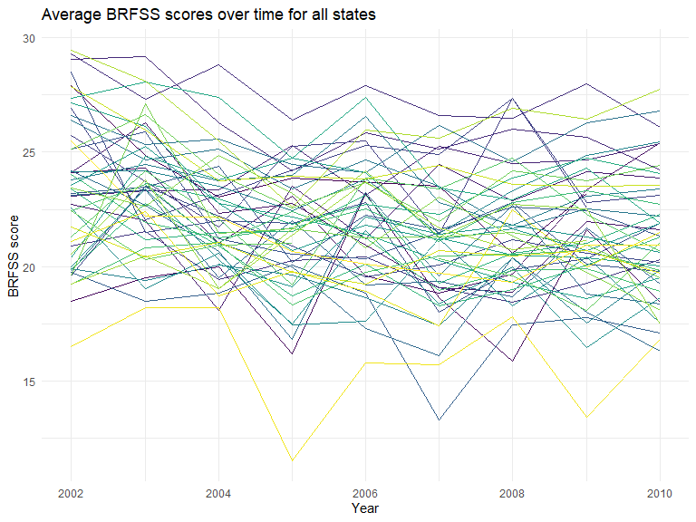

HW 3
================
Ford Holland
10/5/2019

## Problem 1

The goal is to do some exploration of this dataset. To that end, write a
short description of the dataset, noting the size and structure of the
data, describing some key variables, and giving illstrative examples of
observations. Then, do or answer the following (commenting on the
results of each):

  - How many aisles are there, and which aisles are the most items
    ordered from?

<!-- end list -->

``` r
# load instacart data
data("instacart")
glimpse(instacart)
```

    ## Observations: 1,384,617
    ## Variables: 15
    ## $ order_id               <int> 1, 1, 1, 1, 1, 1, 1, 1, 36, 36, 36, 36,...
    ## $ product_id             <int> 49302, 11109, 10246, 49683, 43633, 1317...
    ## $ add_to_cart_order      <int> 1, 2, 3, 4, 5, 6, 7, 8, 1, 2, 3, 4, 5, ...
    ## $ reordered              <int> 1, 1, 0, 0, 1, 0, 0, 1, 0, 1, 0, 1, 1, ...
    ## $ user_id                <int> 112108, 112108, 112108, 112108, 112108,...
    ## $ eval_set               <chr> "train", "train", "train", "train", "tr...
    ## $ order_number           <int> 4, 4, 4, 4, 4, 4, 4, 4, 23, 23, 23, 23,...
    ## $ order_dow              <int> 4, 4, 4, 4, 4, 4, 4, 4, 6, 6, 6, 6, 6, ...
    ## $ order_hour_of_day      <int> 10, 10, 10, 10, 10, 10, 10, 10, 18, 18,...
    ## $ days_since_prior_order <int> 9, 9, 9, 9, 9, 9, 9, 9, 30, 30, 30, 30,...
    ## $ product_name           <chr> "Bulgarian Yogurt", "Organic 4% Milk Fa...
    ## $ aisle_id               <int> 120, 108, 83, 83, 95, 24, 24, 21, 2, 11...
    ## $ department_id          <int> 16, 16, 4, 4, 15, 4, 4, 16, 16, 7, 16, ...
    ## $ aisle                  <chr> "yogurt", "other creams cheeses", "fres...
    ## $ department             <chr> "dairy eggs", "dairy eggs", "produce", ...

``` r
# number of aisles 
instacart %>% 
  count(aisle_id) %>% 
  nrow()
```

    ## [1] 134

``` r
# aisles with the most items ordered
instacart %>% 
  count(aisle_id, aisle) %>% 
  arrange(desc(n))
```

    ## # A tibble: 134 x 3
    ##    aisle_id aisle                              n
    ##       <int> <chr>                          <int>
    ##  1       83 fresh vegetables              150609
    ##  2       24 fresh fruits                  150473
    ##  3      123 packaged vegetables fruits     78493
    ##  4      120 yogurt                         55240
    ##  5       21 packaged cheese                41699
    ##  6      115 water seltzer sparkling water  36617
    ##  7       84 milk                           32644
    ##  8      107 chips pretzels                 31269
    ##  9       91 soy lactosefree                26240
    ## 10      112 bread                          23635
    ## # ... with 124 more rows

  - Make a plot that shows the number of items ordered in each aisle,
    limiting this to aisles with more than 10000 items ordered. Arrange
    aisles sensibly, and organize your plot so others can read it.

<!-- end list -->

``` r
# bar chart
ggp_orders = instacart %>% 
  group_by(aisle_id) %>% 
  mutate(n_items = n()) %>% 
  filter(n_items > 10000) %>% 
  select(aisle_id, aisle, n_items) %>% 
  distinct() %>% 
  arrange(desc(n_items)) %>% 
  ungroup()

ggp_orders %>%   
  ggplot(aes(x = reorder(aisle, -n_items), y = n_items)) +
  geom_bar(stat="identity") +
  labs(title = "Number of Items ordered by Aisle", x = "Aisle name", y = "Number of items ordered") +
  theme(axis.text.x = element_text(angle = 45, hjust = 1))
```


``` r
# histogram
# ggp_hist = instacart %>% 
#   group_by(aisle_id) %>% 
#   mutate(n_items = n()) %>%
#   ungroup() %>% 
#   arrange(desc(n_items)) %>% 
#   select(aisle, aisle_id, n_items)
# 
# ggplot(aes(x = aisle_id, y = n_items)) + 
#   geom_histogram()
```

  - Make a table showing the three most popular items in each of the
    aisles “baking ingredients”, “dog food care”, and “packaged
    vegetables fruits”. Include the number of times each item is ordered
    in your table.

<!-- end list -->

``` r
df_aisle_table = instacart %>% 
  group_by(aisle) %>% 
  filter(aisle %in% 
           c("baking ingredients",
             "dog food care",
             "packaged vegetables fruits")) %>% 
  select(aisle, product_name) %>% 
  count(aisle, product_name) %>% 
  top_n(3) %>% 
  arrange(desc(n)) %>% 
  ungroup()
```

    ## Selecting by n

``` r
df_aisle_table %>% 
  knitr::kable(
    col.names = c("Aisle name", "Product name", "Number ordered"),
    caption = "Three most ordered items for \"baking ingredients\", \"dog food care\", and \"packaged vegetables and fruits\" aisles"
  )
```

| Aisle name                 | Product name                                  | Number ordered |
| :------------------------- | :-------------------------------------------- | -------------: |
| packaged vegetables fruits | Organic Baby Spinach                          |           9784 |
| packaged vegetables fruits | Organic Raspberries                           |           5546 |
| packaged vegetables fruits | Organic Blueberries                           |           4966 |
| baking ingredients         | Light Brown Sugar                             |            499 |
| baking ingredients         | Pure Baking Soda                              |            387 |
| baking ingredients         | Cane Sugar                                    |            336 |
| dog food care              | Snack Sticks Chicken & Rice Recipe Dog Treats |             30 |
| dog food care              | Organix Chicken & Brown Rice Recipe           |             28 |
| dog food care              | Small Dog Biscuits                            |             26 |

Three most ordered items for “baking ingredients”, “dog food care”, and
“packaged vegetables and fruits” aisles

  - Make a table showing the mean hour of the day at which Pink Lady
    Apples and Coffee Ice Cream are ordered on each day of the week;
    format this table for human readers (i.e. produce a 2 x 7 table).

<!-- end list -->

``` r
instacart %>% 
  filter(product_name == "Pink Lady Apples" | 
           product_name == "Coffee Ice Cream") %>% 
  group_by(order_dow, product_name) %>% 
  summarize(mean = mean(order_hour_of_day)) %>% 
  ungroup() %>% 
  # mutate(order_dow = order_dow %>% 
  #          as.character() %>% 
  #          recode("0" = "Sunday",
  #                 "1" = "Monday",
  #                 "2" = "Tuesday",
  #                 "3" = "Wednesday",
  #                 "4" = "Thursday",
  #                 "5" = "Friday",
  #                 "6" = "Saturday")) %>% 
  pivot_wider(names_from = order_dow, values_from = mean) %>% 
  knitr::kable(
    col.names = c("Product name",
                  "Sunday",
                  "Monday",
                  "Tuesday",
                  "Wednesday",
                  "Thursday",
                  "Friday",
                  "Saturday"),
    caption = "Mean hour of the day of product purcase",
    digits = 2)
```

| Product name     | Sunday | Monday | Tuesday | Wednesday | Thursday | Friday | Saturday |
| :--------------- | -----: | -----: | ------: | --------: | -------: | -----: | -------: |
| Coffee Ice Cream |  13.77 |  14.32 |   15.38 |     15.32 |    15.22 |  12.26 |    13.83 |
| Pink Lady Apples |  13.44 |  11.36 |   11.70 |     14.25 |    11.55 |  12.78 |    11.94 |

Mean hour of the day of product purcase

## Problem 2

This problem uses the BRFSS data. DO NOT include this dataset in your
local data directory; instead, load the data from the p8105.datasets
package.

First, do some data cleaning:

  - format the data to use appropriate variable names;
  - focus on the “Overall Health” topic
  - include only responses from “Excellent” to “Poor”
  - organize responses as a factor taking levels ordered from “Poor” to
    “Excellent”

<!-- end list -->

``` r
data("brfss_smart2010")

brfss_smart2010 = brfss_smart2010 %>% 
  janitor::clean_names() %>% 
  #rename(resp_id = respid) %>% 
  filter(topic == "Overall Health") %>% 
  # no other response values to exclude for overall health
  mutate(response = response %>% 
           factor(levels = c("Poor", "Fair", "Good", "Very good", "Excellent"))) 
```

Using this dataset, do or answer the following (commenting on the
results of each):

  - In 2002, which states were observed at 7 or more locations? What
    about in 2010?

<!-- end list -->

``` r
# brfss_smart2010 %>% 
#   separate(locationdesc, into = c("state", "county"), sep = " - ") %>% 
#   count(state, county) %>% 
#   filter(n() > 7)

df_states_02 <- brfss_smart2010 %>% 
  filter(year == 2002) %>% 
  group_by(locationabbr) %>% 
  filter(n() > 7) %>% 
  distinct(locationabbr)

df_states_10 <- brfss_smart2010 %>% 
  filter(year == 2010) %>% 
  group_by(locationabbr) %>% 
  filter(n() > 7) %>% 
  distinct(locationabbr)
```

  - Construct a dataset that is limited to Excellent responses, and
    contains, year, state, and a variable that averages the data\_value
    across locations within a state. Make a “spaghetti” plot of this
    average value over time within a state (that is, make a plot showing
    a line for each state across years – the geom\_line geometry and
    group aesthetic will
help).

<!-- end list -->

``` r
# create a variable that averages the data_value across locations within a state
brfss_smart2010 %>% 
  filter(response == "Excellent") %>% 
  group_by(locationabbr, year) %>% 
  mutate(data_value_avg = mean(data_value)) %>% 
  select(year, locationabbr, data_value_avg) %>% 
  ggplot(aes(x = year, y = data_value_avg)) +
  geom_line(aes(group = locationabbr, color = locationabbr)) +
  theme(legend.position = "none")
```


  - Make a two-panel plot showing, for the years 2006, and 2010,
    distribution of data\_value for responses (“Poor” to “Excellent”)
    among locations in NY State

<!-- end list -->

``` r
brfss_smart2010 %>% 
  filter(year %in% c(2006, 2010)) %>% 
  ggplot(aes(x = response, fill = response)) +
  geom_density(alpha = .5) +
  facet_grid(~year)
```



## Problem 3

Accelerometers have become an appealing alternative to self-report
techniques for studying physical activity in observational studies and
clinical trials, largely because of their relative objectivity. During
observation periods, the devices measure “activity counts” in a short
period; one-minute intervals are common. Because accelerometers can be
worn comfortably and unobtrusively, they produce around-the-clock
observations.

This problem uses five weeks of accelerometer data collected on a 63
year-old male with BMI 25, who was admitted to the Advanced Cardiac Care
Center of Columbia University Medical Center and diagnosed with
congestive heart failure (CHF). The data can be downloaded here. In this
spreadsheet, variables activity.\* are the activity counts for each
minute of a 24-hour day starting at midnight.

Load, tidy, and otherwise wrangle the data. Your final dataset should
include all originally observed variables and values; have useful
variable names; include a weekday vs weekend variable; and encode data
with reasonable variable classes.

{Describe the resulting dataset (e.g. what variables exist, how many
observations, etc).}

``` r
# read and tidy accelerometer data
df_accel = read_csv("Data/accel_data.csv") %>% 
  janitor::clean_names() %>% 
  pivot_longer(cols = starts_with("activity"), 
               names_to = "activity",
               names_prefix = "activity_") %>% 
  mutate(
    activity = activity %>% as.numeric(),
    day = day %>% factor(
      levels = c("Sunday", 
                 "Monday", 
                 "Tuesday", 
                 "Wednesday",
                 "Thursday",
                 "Friday",
                 "Saturday")),
    is_weekend = case_when(
      day %in% c("Saturday", "Sunday") ~ 1,
      TRUE ~ 0
    )
  )
```

    ## Parsed with column specification:
    ## cols(
    ##   .default = col_double(),
    ##   day = col_character()
    ## )

    ## See spec(...) for full column specifications.

``` r
# check mapping of weekend indicator
df_accel %>% count(day, is_weekend)
```

    ## # A tibble: 7 x 3
    ##   day       is_weekend     n
    ##   <fct>          <dbl> <int>
    ## 1 Sunday             1  7200
    ## 2 Monday             0  7200
    ## 3 Tuesday            0  7200
    ## 4 Wednesday          0  7200
    ## 5 Thursday           0  7200
    ## 6 Friday             0  7200
    ## 7 Saturday           1  7200

Traditional analyses of accelerometer data focus on the total activity
over the day. Using your tidied dataset, aggregate accross minutes to
create a total activity variable for each day, and create a table
showing these totals. Are any trends apparent?

Activity seems lowest on saturday, particularly in last 2 weeks; fri and
wed have the highest; weeks 2 and 3 have the activity, week 4 the
lowest.

``` r
df_accel %>% 
  group_by(day, week) %>% 
  mutate(
    daily_total = sum(value)
  ) %>% 
  distinct(day, week, daily_total) %>% 
  ungroup() %>% 
  arrange(day) %>% 
  pivot_wider(names_from = day, values_from = daily_total)
```

    ## # A tibble: 5 x 8
    ##    week Sunday  Monday Tuesday Wednesday Thursday  Friday Saturday
    ##   <dbl>  <dbl>   <dbl>   <dbl>     <dbl>    <dbl>   <dbl>    <dbl>
    ## 1     1 631105  78828. 307094.   340115.  355924. 480543.   376254
    ## 2     2 422018 295431  423245    440962   474048  568839    607175
    ## 3     3 467052 685910  381507    468869   371230  467420    382928
    ## 4     4 260617 409450  319568    434460   340291  154049      1440
    ## 5     5 138421 389080  367824    445366   549658  620860      1440

Accelerometer data allows the inspection activity over the course of the
day. Make a single-panel plot that shows the 24-hour activity time
courses for each day and use color to indicate day of the week. Describe
in words any patterns or conclusions you can make based on this graph

``` r
summary(df_accel$activity)
```

    ##    Min. 1st Qu.  Median    Mean 3rd Qu.    Max. 
    ##     1.0   360.8   720.5   720.5  1080.2  1440.0

``` r
df_accel %>% 
  #filter(day_id %in% c(1, 2)) %>% 
  ggplot(aes(x = activity, y = value)) +
  geom_line(aes(color = day)) +
  # scale_y_continuous(limits = c(-100, 7000)) +
  #theme(legend.position = "none")
  scale_x_continuous(breaks = seq(0, 1500, 180),
                     labels = c("12am", "3am", "6am", "9am", "12pm", "3pm", "6pm", "9pm", "!2am")) +
  labs(title = "Accelerometer data over 24 hour period for 35 days",
       x = "Time of day",
       y = "Activity count",
       color = "Day of the week")
```


<br> <br>
